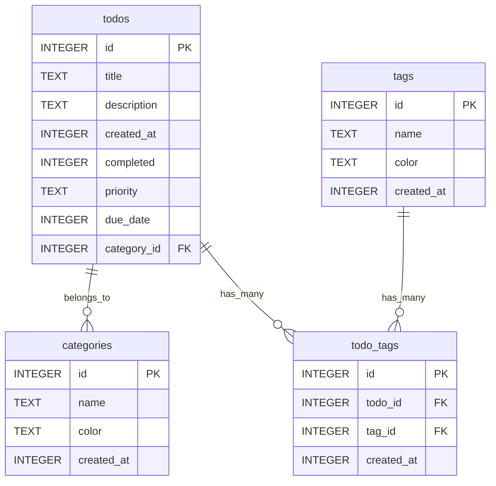

```mermaid
erDiagram
    todos ||--o{ categories : "belongs_to"
    todos ||--o{ todo_tags : "has_many"
    tags ||--o{ todo_tags : "has_many"

    todos {
        INTEGER id PK
        TEXT title
        TEXT description
        INTEGER created_at
        INTEGER completed
        TEXT priority
        INTEGER due_date
        INTEGER category_id FK
    }

    categories {
        INTEGER id PK
        TEXT name
        TEXT color
        INTEGER created_at
    }

    tags {
        INTEGER id PK
        TEXT name
        TEXT color
        INTEGER created_at
    }

    todo_tags {
        INTEGER id PK
        INTEGER todo_id FK
        INTEGER tag_id FK
        INTEGER created_at
    }
``` 